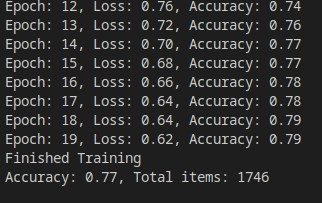

# Sound classification with Pytorch

## Préambule

La classification des sons en utilisant le deep learning est un exercice classique de cette discipline. Pour donner un peu de contexte je vais rappeler comment un son est représenté de manière digitale.

### Représentation digitale d’un son

La digitalisation d’un son passe par la transformation de celui-ci en une série de nombre, cette série correspond à la mesure de l’amplitude du son à un intervalle fixe. Chaque mesure correspond à un sample et le nombre de sample par seconde est ce qu’on appelle la fréquence. La fréquence que l’on va utiliser pour ce projet est de 44 100 samples par seconde

Le modèle de classification utilisé dans ce projet est un réseaux à couches convolutionnelles car nous allons classifier les sons à l’aide de leur spectrogramme.

Les libraries à installer sont:
```bash
pip install pandas pathlib matplotlib pyqt5 torch torchaudio
```

## Traitement des données

Le traitement des données s’effectue avec la classe **AudioUtil**

Cette classe prend d’abord le fichier audio et retourne un tenseur avec le signal ainsi que la fréquence de ce dernier.
Ensuite il y a trois opérations visant à uniformiser les signaux:

- Transformation des signaux en mono en stéréo avec la méthode **rechannel**
- Uniformisation de la fréquence des signaux à 44k1 Hz avec la méthode **resample**
- Ajustement de la longueur des signaux à 4 secondes avec la méthode **pad_trunc**

Une fois cela fait nous faisons une première data augmentation sur le signal. Avec la méthode **time_shift** nous allons décaler à droite et à gauche le son de manière aléatoire, cela est possible dans notre cas car les sons urbains n’ont pas besoin d’être dans un ordre particulier contrairement au discours humain.

Nous allons maintenant transformer ce signal en une image, plus particulièrement en un spectrogramme. Cela va nous permettre d’analyser notre son comme nous le faisons avec CIFAR-10 par exemple. Nous allons utiliser un Mel spectrogramme pour nos sons

### Spectrogramme de type Mel

Un spectrogramme est généré aux transformations de Fourier, la transformation de Fourier va décomposer le signal par ses fréquences et afficher l’amplitude de ces dernières. Pour générer le spectrogramme, la durée du signal va être découper en durées plus petites et une transformation de Fourier va être appliquée à chaque segment. On va ensuite recoller tous les segments pour avoir le spectrogramme.

Le problème avec un spectrogramme classique et qu’il n’ait pas très parlant pour un humain. La variation de la fréquence et de l’amplitude de manière linéaire est quelque chose que nous avons du mal à discerner. Nous percevons les variations de ces deux paramètres de manière logarithmique. Pour afficher un meilleur spectrogramme (pour un humain) nous allons devoir transformer l’amplitude en échelle de décibels et la fréquence en échelle de mels. Ces deux transformations sont effectuées dans la méthode **spectro_gram**. 

Voici un exemple d'un spectrogramme classique:


Une *échelle de mels* représente la manière dont les humains perçoivent le changement d’octave. Un changement d’octave arrive lorsque la fréquence double, hors un humain ne perçoit plus un changement d’octave par doublement de fréquence au dessus de 500 Hz. Prenons l’exemple d’un son à 1000 mels (1000 Hz) l’octave supérieure correspond donc à 2000 mels qui est équivalent 3428 Hz.

Maintenant que le signal a été transformé en Mel spectrogramme, il nous reste une dernière étape de data augmentation avant de créer et d’entraîner notre modèle. Avec la méthode **spectro_augment** nous allons appliquer un masque sur le temps et la fréquence du spectrogramme, cela consiste à ajouter des barres horizontales pour la fréquence et verticales pour le temps.

Images avant et après data augmentation

## Modèle et entraînement

Pour entraîner le modèle nous allons séparer aléatoirement notre ensemble de données de cette manière:

- 80% pour la partie entraînement
- 20% pour la partie test

Le modèle est composé comme suit:

- Première couche convolutionnelle avec 8 neurones et une couche BatchNormalization avec 8 en paramètre. L’activation se fait avec la fonction ReLU
- Deuxième couche avec 16 neurones et une couche BatchNormalization avec 16 en paramètre. L’activation se fait avec la fonction ReLU
- Troisième couche avec 32 neurones et une couche BatchNormalization avec 32 en paramètre. L’activation se fait avec la fonction ReLU
- Quatrième couche avec 64 neurones et une couche BatchNormalization avec 64 en paramètre. L’activation se fait avec la fonction ReLU
- Une couche d’adaptative average pooling
- Une couche de sortie Linéaire de taille 10

## Résultats et conclusion

Tout d’abord le temps d’exécution de ce réseau était assez long sur ma machine donc je n’ai pas pu faire beaucoup de tests (l’auteur fait tourner son réseau sur un GPU). Le meilleur résultat obtenu est une précision de 79% en training et 77% en test, pour un nombre de 20 epochs. Cela se rapproche de ce que j’ai pu trouver dans d’autres articles qui annoncent une précision aux alentours des 80%. 

<p align="center>
          
</p>

On peut voir qu’il y a un peu d’overfitting, avec un peu d’optimisation on pourrait obtenir les 80% (ajout de dropout et de couches denses, plus de couches convolutionnelles avec plus de neurones...). Enfin, j’ai eu quelques difficultés à modifier le réseau car je ne suis pas familiarisé avec Pytorch.
